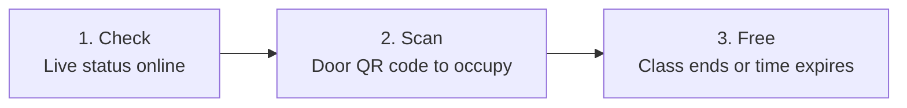

# Classroom Finder

A real-time web app that helps students, lecturers, and staff find and manage available classrooms on campus using QR codes.

**Live Website:** [https://classrooom-finder.page.gd](https://classrooom-finder.page.gd)

---

## What is Classroom Finder?

In busy schools and universities, people often walk from room to room just to see if a classroom is empty. **Classroom Finder** solves this:

- **Students** can immediately see which rooms are free or occupied right from their phones—no login required.
- **Lecturers** walk up to a room, scan the QR code posted at the door, and claim the room for their class.
- **Administrators** set up rooms, manage lecturer accounts, schedule weekly classes, and monitor real-time campus room usage.

---

## How It Works in 3 Simple Steps



> **1. Check** &nbsp;➔&nbsp; **2. Scan** &nbsp;➔&nbsp; **3. Free**

1. **Check Live Status**: The homepage lists all rooms by building, floor, type, and capacity. Live colors tell you what is happening right now:
   - 🟢 **Available**: Ready to use.
   - 🔴 **Occupied**: In use by a lecturer or active schedule slot. Shows who is inside and until what time.
   - ⚪ **Unavailable**: Room is undergoing maintenance or temporarily disabled.
2. **Scan to Occupy**: Each door has a printed QR poster. A lecturer logs in on their phone, scans the QR code with their camera (or enters the 8-character short token), picks a duration within campus scanning hours, and the room status instantly turns red (Occupied) across campus.
3. **Automatic / Manual Release**: When class ends, the lecturer taps "End Session". If they forget, the system automatically marks the room available again once the selected duration expires.

---

## Who Uses It?

| User | What They Do | Login Needed? |
|---|---|:---:|
| **Students & Public** | Browse rooms, search by building/floor/capacity, see live availability. | ❌ No |
| **Lecturers** | Scan door QR codes, enter 8-character codes, start/end room sessions, view personal usage history. | ✅ Yes |
| **Administrators** | Manage rooms, batch print QR posters, create accounts, set fixed weekly timetables, view analytics. | ✅ Yes |

---

## Key Features

- **Live Campus Overview**: Automatically updates room status without manual page refreshes via background polling.
- **Dual Check-in (QR Scanner & 8-Character Manual Entry)**: Scan door QR codes via camera or enter short 8-character hex codes manually.
- **Daily Scanning Hours**: Configurable campus hours enforcement (e.g. 7:00 AM – 7:00 PM) preventing off-hours claims.
- **Batch & Single Printable QR Posters**: Table management with individual print, multi-room checkbox selection, and responsive print sheet layouts (6 per page).
- **Concurrency & Anti-Race Protection**: Row-level database locking (`SELECT ... FOR UPDATE` in transactions) prevents simultaneous room claims.
- **Recurring Class Schedules**: Weekly timetable support that automatically marks rooms occupied during class hours.
- **Schedule Force-Open**: Instructors can report absentee lecturers or emergencies to override and claim scheduled rooms.
- **Automated Session Expiry**: CLI worker (`cron/expire.php`) and lazy request triggers automatically release expired sessions.
- **Mobile Friendly & Offline Support (PWA)**: Camera scanning, responsive layout, home-screen install (`manifest.json`), and service-worker caching (`sw.js`).
- **First-Run Lock Protection**: `setup.php` creates initial administrator and permanently locks itself via `installed.lock`.

---

## Project Structure

```text
classroom_finder/
├── admin/                     # Administrator portal
│   ├── classrooms.php         # Manage classrooms (CRUD, capacity, floor, type)
│   ├── dashboard.php          # Campus overview, real-time metrics & system stats
│   ├── history.php            # Past room usage records & CSV export
│   ├── logs.php               # System activity & security audit logs
│   ├── qr_codes.php           # QR code generator, table viewer & printable posters
│   ├── schedules.php          # Recurring weekly timetable manager & printable sheets
│   ├── sessions.php           # Live room sessions & force-end controls
│   ├── settings.php           # Institution name, address, branding, scan hours & durations
│   └── users.php              # Lecturer and admin account management
├── api/                       # Background JSON API endpoints
│   ├── classroom_status.php   # Real-time room status polling endpoint
│   ├── force_open.php         # Handles schedule override requests
│   ├── release_room.php       # Handles ending active room sessions
│   └── scan_qr.php            # Verifies scanned QR codes & availability
├── assets/                    # Static UI assets
│   ├── css/                   # Custom design system stylesheet
│   ├── fonts/                 # Self-hosted Barlow & IBM Plex font families
│   ├── js/                    # UI logic, scanner handler, landing poll, SweetAlert2 modals
│   ├── sound/                 # Audio cues for scan success/error
│   └── uploads/               # Uploaded school branding logo
├── auth/                      # Authentication & session verification
│   ├── auth_check.php         # Role authorization guards (admin/lecturer)
│   └── login_process.php      # Login authentication & credential checks
├── config/                    # Core configuration & helpers
│   ├── .htaccess              # Direct access restriction (Require all denied)
│   ├── database.php           # PDO database singleton connection
│   ├── helpers.php            # Global helper functions, CSRF, flash, queries
│   ├── icons.php              # Inline SVG icon generator
│   └── layout.php             # Unified page headers, navigation & footers
├── cron/                      # Background maintenance tasks
│   └── expire.php             # CLI session expiry worker for finished sessions
├── database/                  # Database scripts & schema
│   ├── .htaccess              # Direct access restriction (Require all denied)
│   ├── classroom_finder.sql   # Complete MariaDB/MySQL database schema
│   └── seed_classrooms.php    # CLI/admin classroom sample data seeder
├── lecturer/                  # Lecturer self-service portal
│   ├── dashboard.php          # Personal active sessions & history overview
│   ├── history.php            # Lecturer usage history logs
│   ├── occupy.php             # Session creation handler with row-level lock
│   ├── release.php            # Session release handler for active room
│   └── scanner.php            # QR camera scanner & manual 8-char code entry
├── qr/                        # QR generation engine
│   ├── generate.php           # Dynamic QR image generation endpoint
│   └── lib/                   # Embedded phpqrcode generation library
├── services/                  # Business logic & domain services
│   ├── room_service.php       # Room availability, computed status, CRUD & token generator
│   ├── schedule_service.php   # Recurring class timetables & schedule slots
│   ├── session_service.php    # Live room occupancy sessions & expiry
│   └── user_service.php       # Account authentication, CRUD, and status
├── .htaccess                  # Apache hardening (indexing, extensions, security headers)
├── 404.php                    # Custom error 404 page
├── change_password.php        # Authenticated user password update
├── index.php                  # Public live classroom availability board
├── login.php                  # Sign-in portal for staff & administrators
├── logout.php                 # Secure session destruction & sign-out
├── manifest.json              # PWA web app manifest
├── setup.php                  # First-run locked admin initialization
└── sw.js                      # Service worker for offline asset caching
```

---

## Getting Started (XAMPP / Local Setup)

### Requirements
- PHP 8.1+
- MySQL 5.7+ / MariaDB 10.4+
- Apache (e.g., standard [XAMPP](https://www.apachefriends.org/))

### Installation

1. Clone or copy this project into your web server folder:
   ```text
   C:\xampp\htdocs\classroom_finder
   ```
2. Start **Apache** and **MySQL** from your XAMPP Control Panel.
3. Create and import the database:
   - Open **phpMyAdmin** (`http://localhost/phpmyadmin/`).
   - Create a database named `classroom_finder`.
   - Click **Import**, choose `database/classroom_finder.sql`, and click **Import**.
   *(Alternatively via terminal: `mysql -u root -p classroom_finder < database/classroom_finder.sql`)*
4. *(Optional)* Seed sample classrooms:
   ```bash
   php database/seed_classrooms.php
   ```
5. Check your database settings in `config/database.php` (defaults to `root` with no password).
6. Open your browser and complete first-time setup:
   ```text
   http://localhost/classroom_finder/setup.php
   ```
   This creates your initial Administrator account. Once created, `setup.php` locks permanently.
7. Sign in via `http://localhost/classroom_finder/login.php`.
8. Configure session auto-expiration worker:
   Run `php cron/expire.php` manually or schedule it via Windows Task Scheduler / Linux Cron to run every minute.

---

## Daily Operations Quick Guide

- **Print Door QR Posters**: Go to **Admin** → **QR Codes** → click **Print all posters** (or print individual rooms). Post them beside room doors.
- **Create Lecturer Accounts**: Go to **Admin** → **Users** → **Add user**.
- **Scan via Mobile**: Connect your phone to the same local network or Wi-Fi as the server. Navigate to `http://<YOUR-PC-IP>/classroom_finder/` and log in as a lecturer to scan.
- **Run Expiry Worker**: Keep `php cron/expire.php` scheduled to auto-clear rooms after occupancy expires.

---

## Technical & Security Highlights

- **SQL Injection Safe**: 100% prepared PDO statements with parameter binding across all queries.
- **CSRF Protected**: Synchronizer token pattern validates all state-changing form and API actions.
- **Anti-Race Condition**: Row-level database locking (`SELECT ... FOR UPDATE`) prevents simultaneous room claims.
- **Directory & File Hardening**: Root and subdirectory `.htaccess` rules disable directory listings, restrict direct access to sensitive file extensions (`.sql`, `.log`, `.env`, `.lock`, `.md`, `.json`), protect `config/` and `database/`, and emit security headers (`X-Frame-Options`, `X-Content-Type-Options`, `Referrer-Policy`).
- **Setup Lockout**: Automatic lockfile (`installed.lock`) and user count verification permanently seals `setup.php`.
- **CLI Expiry Guard**: `cron/expire.php` enforces CLI-only execution (`PHP_SAPI === 'cli'`), blocking remote web invocations.
- **Secure Authentication**: Passwords hashed using industry-standard `bcrypt` (`password_hash`), session verification, and role-based access control.
- **Zero External UI Dependencies**: Fonts, inline SVG icons, SweetAlert2, and QR generator (`phpqrcode`) are fully self-hosted for fast, air-gapped local reliability.
